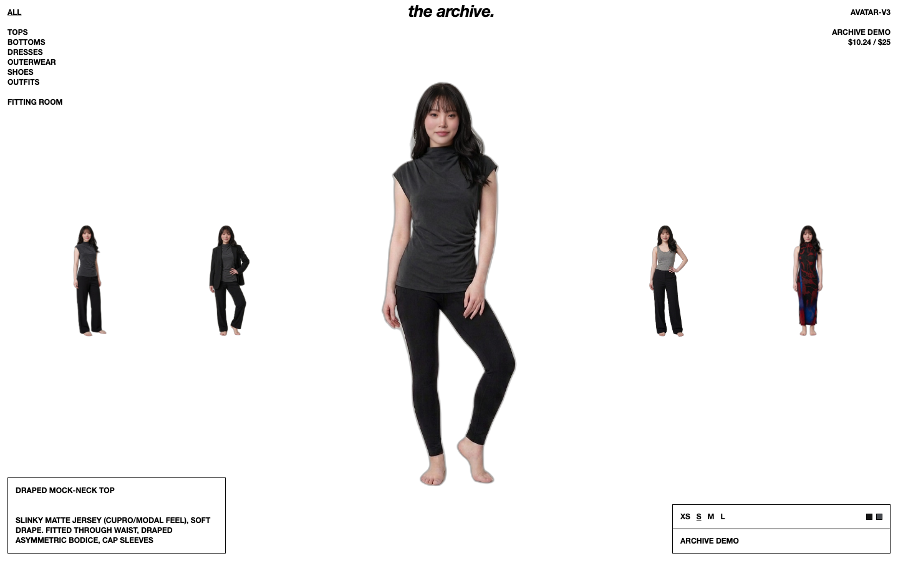
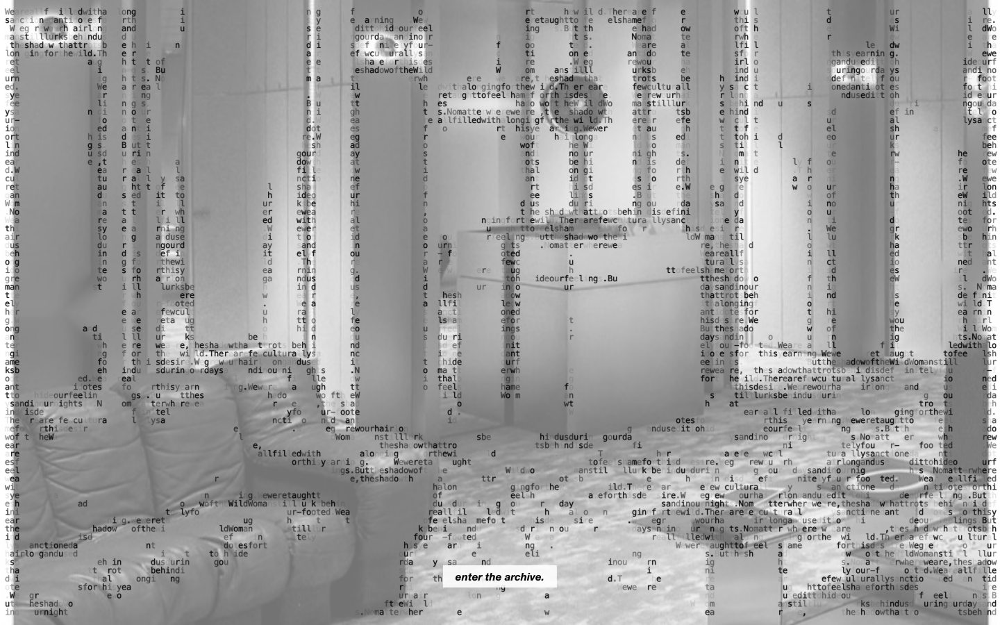
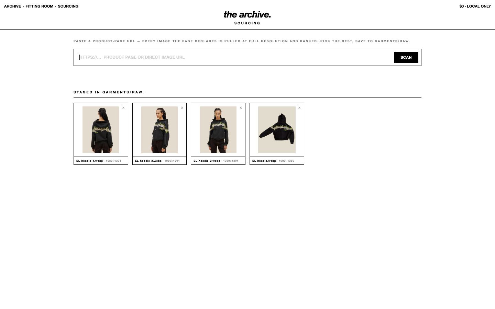

# the archive.

A photorealistic virtual closet: my real wardrobe, tried on by a persistent
personal avatar. Single-user, local-first, built around a strict generation
budget.



## What it is

Every garment I own is ingested from product photos, then rendered onto a
consistent avatar with an image-editing model — so the closet can be browsed,
mixed into outfits, and "worn" without touching the physical rack.

Two views, one brand:

- **`/` — the archive.** A carousel of published looks — complete outfits
  worn by the avatar — behind an ASCII-art entrance sequence. Clicking a
  look opens a detail overlay (its garments, sizes, pose) with a door into
  the fitting room.
- **`/fitting-room`** — outfit rail, mirror stage, and index racks.
  Garments can be clicked or **dragged onto the mirror**: the cutout rides
  the cursor with grab-lift and directional tilt, the avatar raises her hands
  to receive it, and the render lands on the stage.


Outfits are saved as **looks** (free drafts), then **published** — one
render in a chosen pose plus a cutout pass — to appear in the archive
carousel. The carousel shows only published looks; individual garments stay
on the fitting-room racks. Cross-document view transitions morph the figure
between the two pages.



## How it works

- **Server** — `virtual-closet/scripts/closet_server.py`, a zero-dependency
  Python stdlib server. Files on disk are the source of truth: garments,
  renders, and looks are folders and JSON, no database.
- **Try-on pipeline** — `scripts/tryon.py`: nano-banana-2/edit for the
  garment swap, finished with a face-swap pass so the avatar's identity
  never drifts ($0.059 per render). Chosen over alternatives via a small
  benchmark (`virtual-closet/docs/phase3-benchmark.md`).
- **Feedback loop** — every render gets one-tap feedback buttons that fire
  targeted corrective edits ("wrong fit", "wrong color" + a note).
- **Budget guard** — every generation call is logged and gated by
  `scripts/genlog.py` against a hard spend cap. The whole catalog — 57
  garments rendered, corrected, and cut out — has cost about $10.
- **Ingest** — `/sourcing` scans a product-page URL, ranks its images, and
  stages the best ones; cutouts and drag silhouettes are extracted with
  rembg (general model for product shots, cloth-seg for on-model photos).



## Running it

```bash
cd virtual-closet
python3 scripts/closet_server.py            # browse-only at localhost:8765
ENABLE_GENERATION=1 python3 scripts/closet_server.py   # live rendering (fal key + budget gate)
```

A read-only demo deploys as a static site: `scripts/export_static.py`
snapshots the API and referenced assets into `site/`, and the root
`vercel.json` runs it as the build. Browsing and drag-to-dress work
entirely from static files; generation stays local. The sourcing page
isn't part of the demo — it depends on the live server to fetch and rank
remote product pages, so a static export has nothing to back it.

## Notes

The avatar is me. Garment source photos are retailer product imagery,
collected for personal styling use — not for redistribution. Brand names in
garment metadata identify my own clothes; no affiliation implied.
